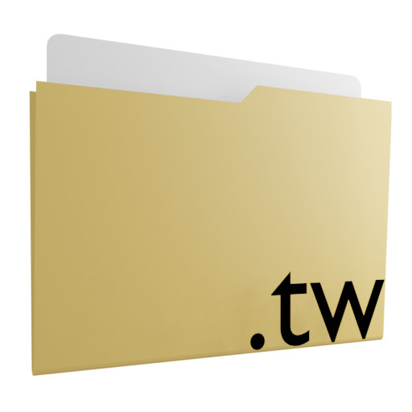

<h1 align="center">TinyWiki</h1>
<p align="center">
  
</p>
<p align="center">Folder structure-based PHP wiki documentation engine</p>

  

<p>This is a super simple PHP folder structure based wiki engine<br>
for creating code documentation webpages with support for Markdown Language<br>
using <a href="http://parsedown.org/">Parsedown</a> or alternatively it's own Work-in-Progress Markup language (.tinyw),<br>
and also features an implementation of <a href="https://highlightjs.org/">Highlight.js</a>
for syntax highlighting.</p>


# Setting up
1. Download the latest release, or alternatively if you want to be on the bleeding-edge with the
latest features, you may download the repository directly and remove the unecessary files, but
be aware that bugs should be expected outside of releases.
2. After downloading the archive, extract it's contents into any (empty) directory of your
website / webserver.
3. Opening the webpage for the first time should come up with a configuration prompt. (Alternatively you can change the configs manually)

# Running Dependencies
* [PHP](https://secure.php.net/) >= 5.3.0 

# using .tinyw file
tinyw is a work-in-progress simple markup language, it aims to provide a simple standardized way to
write code documentation.

## Syntax:
```
# comment

<code="lua">
-- lua code
</code>

<code="cpp">
// cpp code
</code>

*bold text*

_italic text_

_*bold and italic*_

<u>underline text</u>

<s>strikethrough text</s>


<link="http://example.com">link text</link>

<html><button>Custom HTML Button</button></html>
```

## Permissions:
By default you don't really need to modify the permissions on your server, but if you do want that,
the ones you are free to hide from the web are:
 `bin/`
 `/docs/`

